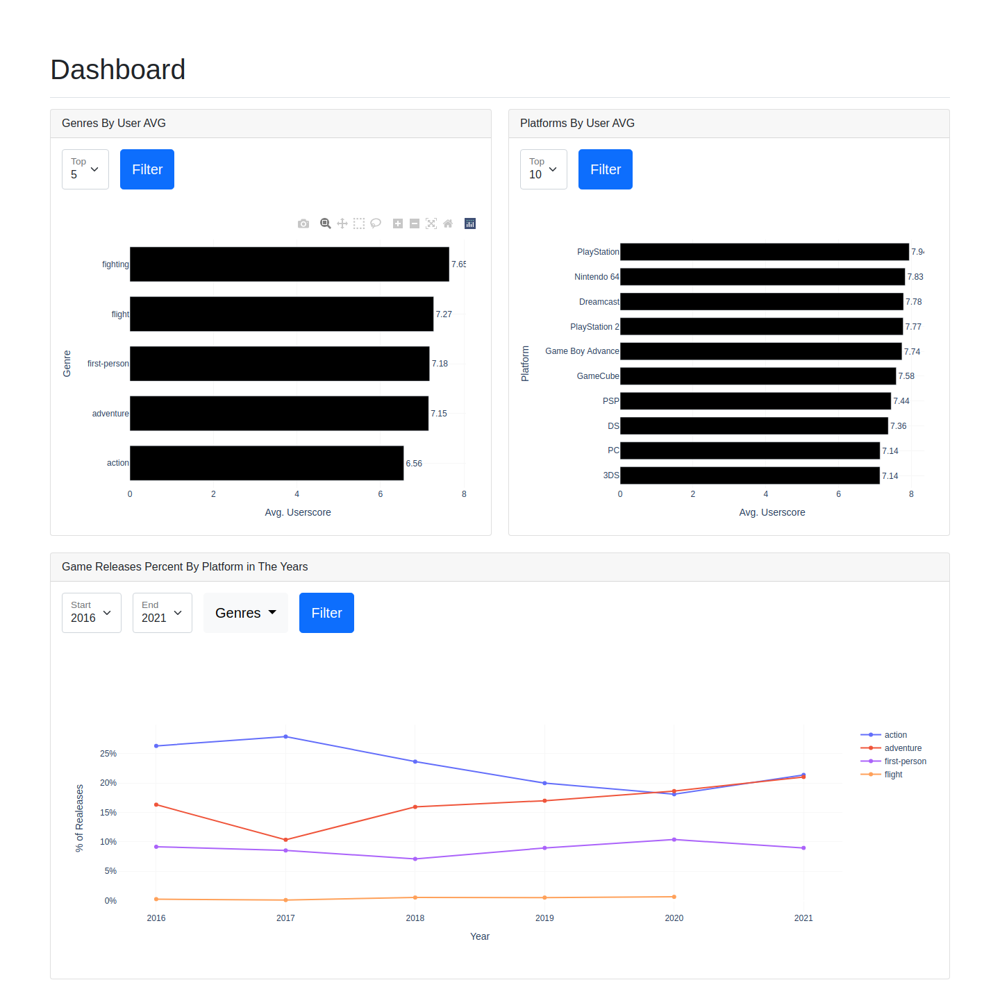

# Data Visualization With Python + Vue

This project aims to explore ``plotly`` library to build and serve a dashboard throughout a flask api.

On the other side, to present these plots for users, vue is being used with a bootstrap template.



## Running

This project was configured to be easy to use, just follow the bellow steps:

1. Install and configure ``docker`` and ``docker-compose`` in your computer.

2. After that just start docker compose with the following command:

    ```bash
    $ docker-compose up --build backend frontend
    ```

3. Now it's time to access the [Dashboard](http://localhost:8080/).

## Conclusion

This project was only a prof of concept to try the ``flask`` framework with a web interface written with ``vue`` using ``plotly`` library.

It was very easy to configure this project, build the charts and configure the interface. I believe that it can be used for commercial proposals and be very acceptable.


## Contributors

**Priscilla Trindade** [Github](#)

**Rafael Souza da Silva** [Github](https://github.com/arkanister)
